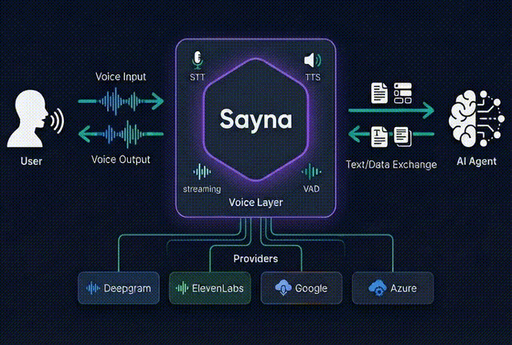

# Sayna

A high-performance real-time voice processing server built in Rust that provides unified Speech-to-Text (STT) and Text-to-Speech (TTS) services through WebSocket and REST APIs.




## Features

- **Unified Voice API**: Single interface for multiple STT/TTS providers
- **Real-time Processing**: WebSocket-based bidirectional audio streaming
- **LiveKit Integration**: WebRTC audio streaming with room-based communication
- **VAD + Turn Detection**: Silero-VAD for audio-level silence detection with integrated ML-based end-of-turn detection (`stt-vad` feature)
- **Advanced Noise Filtering**: Optional DeepFilterNet integration (`noise-filter` feature)
- **Provider Flexibility**: Pluggable architecture supporting multiple providers
  - Deepgram (STT/TTS)
  - ElevenLabs (STT/TTS)
  - Google Cloud (STT/TTS) - WaveNet, Neural2, and Studio voices
  - Microsoft Azure (STT/TTS) - 400+ neural voices across 140+ languages
- **Audio-Disabled Mode**: Development mode without API keys

## Quick Start

### Prerequisites

- Docker
- At least one provider API key (optional - can run in audio-disabled mode)

### Run with Docker

```bash
docker run -d \
  -p 3001:3001 \
  -e DEEPGRAM_API_KEY=your-key \
  saynaai/sayna
```

The server will be available at `http://localhost:3001`.

### Docker Compose

```yaml
version: "3.9"
services:
  sayna:
    image: saynaai/sayna
    ports:
      - "3001:3001"
    environment:
      DEEPGRAM_API_KEY: ${DEEPGRAM_API_KEY}
      ELEVENLABS_API_KEY: ${ELEVENLABS_API_KEY}
      CACHE_PATH: /data/cache
    volumes:
      - sayna-cache:/data/cache

volumes:
  sayna-cache: {}
```

For complete Docker documentation including LiveKit integration, see [docs/docker.md](docs/docker.md).

### Running Without API Keys (Audio-Disabled Mode)

You can run Sayna without Deepgram or ElevenLabs API keys by using the audio-disabled mode. Simply start the server without configuring the API keys, then send a WebSocket configuration message with `audio_disabled: true`:

```json
{
  "type": "config",
  "config": {
    "audio_disabled": true,
    "stt_provider": "deepgram",
    "tts_provider": "elevenlabs"
  }
}
```

This mode is useful for:
- Local development and testing
- UI/UX development without audio processing
- Testing WebSocket message flows
- Debugging non-audio features

## Authentication (Optional)

Sayna supports customer-based authentication that delegates token validation to an external authentication service. When enabled, protected API endpoints require a valid bearer token.

### Enabling Authentication

Add to your `.env` file:
```env
AUTH_REQUIRED=true
AUTH_SERVICE_URL=https://your-auth-service.com/auth
AUTH_SIGNING_KEY_PATH=/path/to/auth_private_key.pem
AUTH_TIMEOUT_SECONDS=5
```

Generate signing keys:
```bash
# Generate RSA private key
openssl genrsa -out auth_private_key.pem 2048

# Extract public key (share with auth service)
openssl rsa -in auth_private_key.pem -pubout -out auth_public_key.pem
```

### Making Authenticated Requests

```bash
curl -X POST http://localhost:3001/speak \
  -H "Authorization: Bearer your-token-here" \
  -H "Content-Type: application/json" \
  -d '{"text": "Hello world"}'
```

For complete authentication setup and architecture details, see [docs/authentication.md](docs/authentication.md).

## API Endpoints

### WebSocket

- **Endpoint**: `/ws`
- **Protocol**: WebSocket
- **Purpose**: Real-time bidirectional audio streaming and control

#### Message Types

**Configuration Message**:
```json
{
  "type": "config",
  "config": {
    "stt_provider": "deepgram",
    "tts_provider": "elevenlabs",
    "audio_disabled": false,
    "deepgram_model": "nova-2",
    "elevenlabs_voice_id": "voice_id_here"
  }
}
```

**Audio Input**: Binary audio data (16kHz, 16-bit PCM)

**Text Input**:
```json
{
  "type": "text",
  "text": "Convert this text to speech"
}
```

### REST API

- **Health Check**: `GET /` - Server health check endpoint
- **Voices**: `GET /voices` - List available TTS voices (requires auth if `AUTH_REQUIRED=true`)
- **Speak**: `POST /speak` - Generate speech from text (requires auth if `AUTH_REQUIRED=true`)
- **LiveKit Token**: `POST /livekit/token` - Generate LiveKit participant token (requires auth if `AUTH_REQUIRED=true`)
- **LiveKit Webhook**: `POST /livekit/webhook` - Webhook endpoint for LiveKit events (unauthenticated, uses LiveKit signature verification)
  - Called by LiveKit to deliver room and participant events
  - Validates requests using LiveKit's JWT signature mechanism
  - Logs SIP-related attributes for phone call troubleshooting
  - See [docs/livekit_webhook.md](docs/livekit_webhook.md) for details

## Architecture Overview

### Core Components

- **VoiceManager**: Central coordinator for all voice processing operations
- **Provider System**: Trait-based abstraction for pluggable STT/TTS providers
- **WebSocket Handler**: Real-time communication and message routing
- **LiveKit Integration**: WebRTC audio streaming and room management
- **DeepFilterNet**: Advanced noise reduction with adaptive processing

### Request Flow

1. Client establishes WebSocket connection to `/ws`
2. Client sends configuration with provider selection
3. Audio processing pipeline:
   - **STT**: Audio � Noise Filter (optional) � STT Provider � Text
   - **TTS**: Text � TTS Provider � Audio � Client
4. LiveKit mode enables room-based audio streaming

## Development

For local development, you can build and run from source.

### Prerequisites

- Rust 1.88.0 or later
- Optional: ONNX Runtime (for `stt-vad` feature which includes VAD and turn detection)

### Building from Source

```bash
# Development build
cargo build

# Release build (optimized)
cargo build --release

# Run the server
cargo run

# Run with a config file
cargo run -- -c config.yaml
```

### Feature Flags

Sayna exposes several Cargo features that gate heavyweight subsystems:

- `stt-vad`: Silero-VAD voice activity detection with integrated ONNX-based turn detection. When enabled, VAD monitors audio for silence and triggers the turn detection model to confirm if the speaker's turn is complete.
- `noise-filter`: DeepFilterNet noise suppression pipeline
- `openapi`: OpenAPI 3.1 specification generation

```bash
# Run with VAD and turn detection
cargo run --features stt-vad

# Run with noise filter
cargo run --features noise-filter

# Run with multiple features
cargo run --features stt-vad,noise-filter,openapi
```

The Docker image includes `stt-vad` and `noise-filter` by default.

### Testing

```bash
# Run all tests
cargo test

# Run specific test
cargo test test_name

# Run with output
cargo test -- --nocapture
```

### Code Quality

```bash
# Format code
cargo fmt

# Run linter
cargo clippy

# Check for security vulnerabilities
cargo audit
```

### Building Docker Image Locally

```bash
# Build Docker image
docker build -t sayna .

# Run container
docker run -p 3001:3001 --env-file .env sayna
```

## Configuration

### Environment Variables

| Variable | Description | Default | Required |
|----------|-------------|---------|----------|
| `DEEPGRAM_API_KEY` | Deepgram API authentication | - | No* |
| `ELEVENLABS_API_KEY` | ElevenLabs API authentication | - | No* |
| `GOOGLE_APPLICATION_CREDENTIALS` | Path to Google Cloud service account JSON | - | No* |
| `AZURE_SPEECH_SUBSCRIPTION_KEY` | Azure Speech Services subscription key | - | No* |
| `AZURE_SPEECH_REGION` | Azure region (e.g., eastus, westeurope) | `eastus` | No* |
| `LIVEKIT_URL` | LiveKit server WebSocket URL | `ws://localhost:7880` | No |
| `LIVEKIT_API_KEY` | LiveKit API key (for webhooks and token generation) | - | No*** |
| `LIVEKIT_API_SECRET` | LiveKit API secret (for webhooks and token generation) | - | No*** |
| `HOST` | Server bind address | `0.0.0.0` | No |
| `PORT` | Server port | `3001` | No |
| `AUTH_REQUIRED` | Enable authentication | `false` | No |
| `AUTH_API_SECRETS_JSON` | API secrets JSON array (`[{id, secret}]`) | - | Yes** |
| `AUTH_API_SECRET` | Legacy single API secret | - | No**** |
| `AUTH_API_SECRET_ID` | Legacy API secret id for `AUTH_API_SECRET` | `default` | No |
| `AUTH_SERVICE_URL` | External auth service endpoint | - | Yes** |
| `AUTH_SIGNING_KEY_PATH` | Path to JWT signing private key | - | Yes** |
| `AUTH_TIMEOUT_SECONDS` | Auth request timeout | `5` | No |

*Not required when using audio-disabled mode
**Required when `AUTH_REQUIRED=true` for the auth method you choose
***Required for LiveKit webhook validation and token generation features
****Legacy single-secret fallback; prefer `AUTH_API_SECRETS_JSON`

### SIP Configuration (Optional)

Sayna supports first-class SIP configuration for managing SIP-specific settings. See [docs/sip_config.md](docs/sip_config.md) for detailed documentation.

**YAML Configuration:**
```yaml
sip:
  room_prefix: "sip-"
  allowed_addresses:
    - "192.168.1.0/24"
    - "10.0.0.1"
  hook_secret: "your-signing-secret"  # Required if hooks configured
  hooks:
    - host: "example.com"
      url: "https://webhook.example.com/events"
```

**Important:** All SIP webhook forwarding requests are signed with HMAC-SHA256. You **must** configure `hook_secret` (or per-hook `secret` overrides) if using `sip.hooks`. See [docs/livekit_webhook.md#webhook-signing](docs/livekit_webhook.md#webhook-signing) for signature verification examples.

**Environment Variables:**
- `SIP_ROOM_PREFIX`: Room name prefix for SIP calls (required if SIP enabled)
- `SIP_ALLOWED_ADDRESSES`: Comma-separated IP addresses/CIDRs
- `SIP_HOOK_SECRET`: Global signing secret for webhook authentication (min 16 chars)
- `SIP_HOOKS_JSON`: JSON array of webhook configurations (with optional per-hook `secret` field)

## Performance Considerations

- **DeepFilterNet**: CPU-intensive processing uses thread pooling
- **Audio Buffering**: Optimized chunk processing for low latency
- **Connection Reuse**: Provider connections are maintained for efficiency
- **Async Processing**: Non-blocking WebSocket message handling
- **Memory Management**: Careful buffer management in audio loops

## Contributing

1. Review the development rules in `.cursor/rules/`:
   - `rust.mdc`: Rust best practices
   - `core.mdc`: Business logic specifications
   - `axum.mdc`: Framework patterns
   - `livekit.mdc`: LiveKit integration details

2. Follow the existing code patterns and conventions
3. Add tests for new features
4. Ensure `cargo fmt` and `cargo clippy` pass

## Support

For issues, questions, or contributions, please visit the [GitHub repository](https://github.com/saynaai/sayna).
